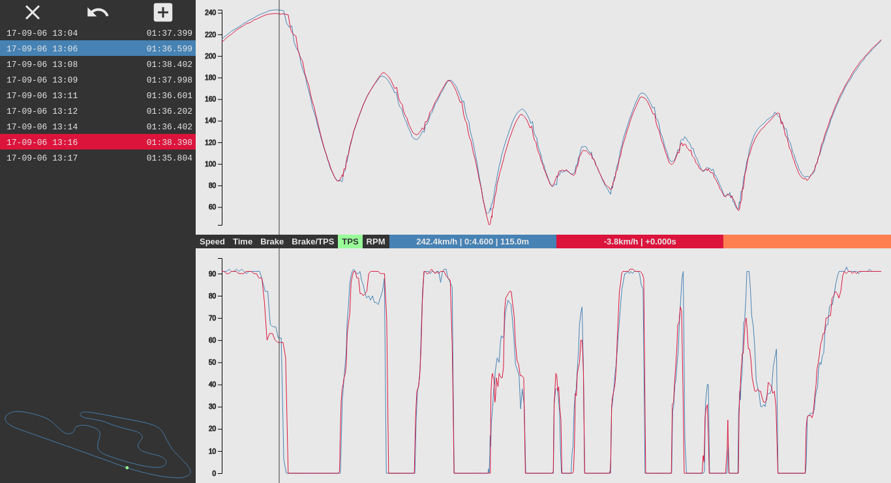

View telemetry data from RaceCapture, VBox, and custom logging
hardware. Calculate approximate lap times and comparisons between laps
(see issues below).

There is currently (very poor and only very lightly tested) support
for loading .log files from RaceCapture systems and CSV files from
VBox.

It can also load any CSV file which has at least the
following column (in any order):

    Seconds,KMH,RPM,Lat,Lon,TPS,Brake

# Current issues:
- I don't know how to write good JavaScript yet (this is how I'm learning)
- Cumulative time comparison doesn't work
- Lap timing calculation has at least one bug
- It only works for two tracks in the South Island of New Zealand
 
When it does work it looks like this:

